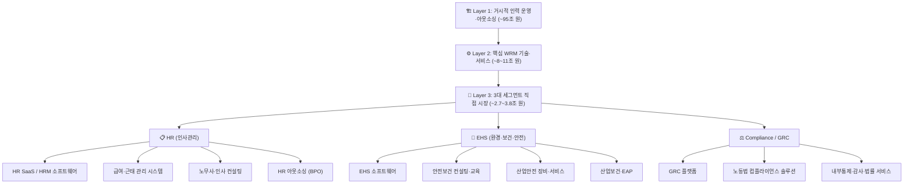
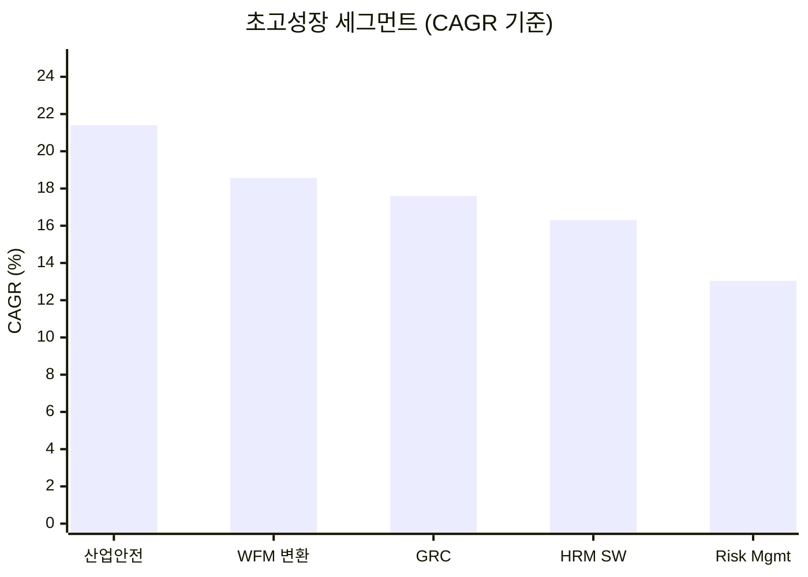
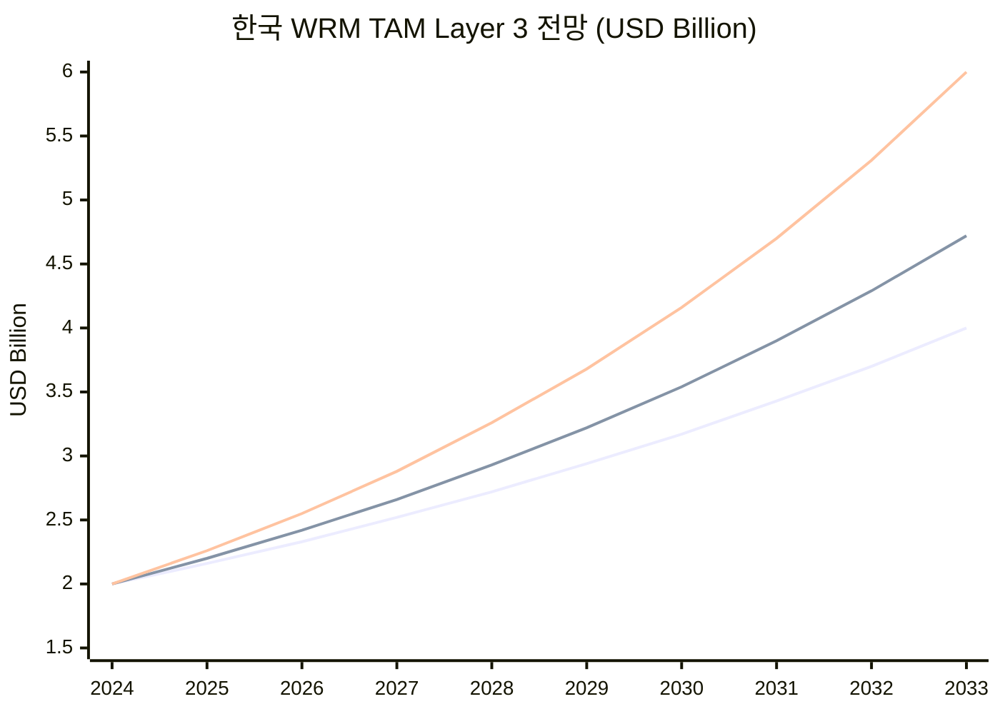
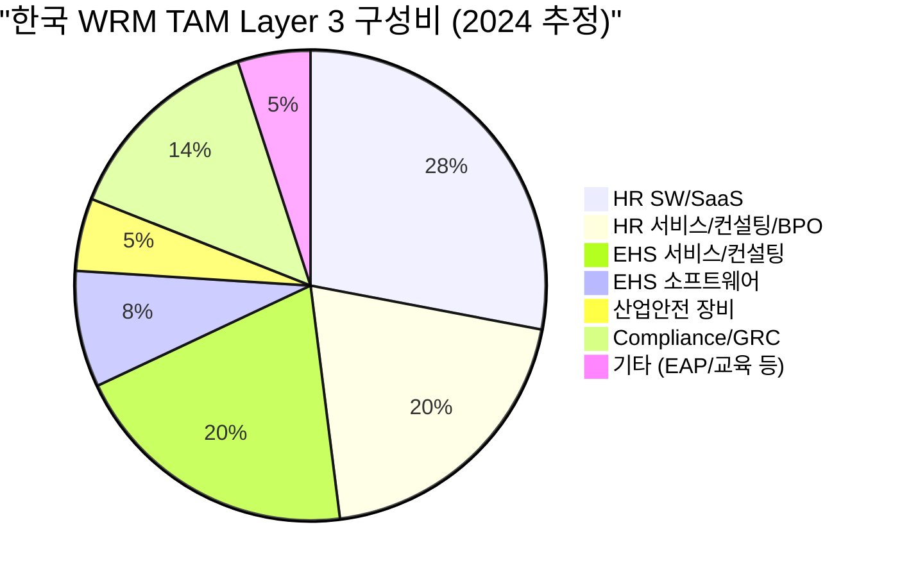
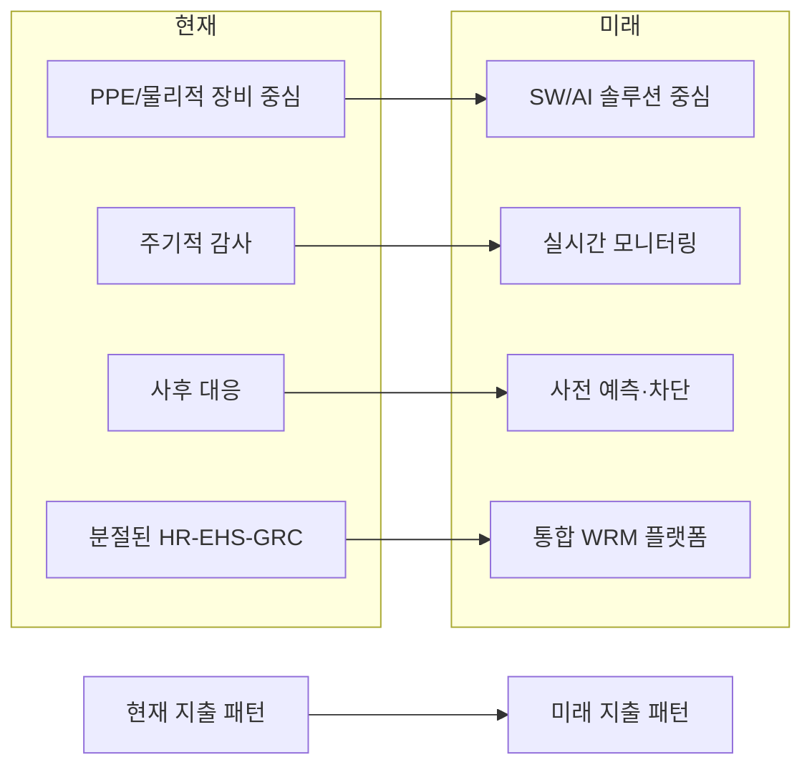

# 한국 인력 리스크 관리(Workforce Risk Management) 시장 TAM 종합 분석 보고서

> **분석 기준일**: 2026년 4월 | **분석 범위**: HR + EHS + Compliance, 전체 기업 규모, 전체 솔루션 유형(SW·서비스·컨설팅·아웃소싱)
> **종합 근거**: Gemini Pro / GPT / Gemini Deep / Opus 4개 분석 결과 통합

---

## 1. Executive Summary

### 핵심 TAM 추정 결과

| 시장 층위 | 2024년 추정 (USD) | 2024년 추정 (KRW) | 비고 |
|---|---|---|---|
| **[Layer 1] 거시적 인력 운영·아웃소싱** | ~$70B | **~95조 원** | 파견·도급·BPO 등 리스크 전가 시장 |
| **[Layer 2] 핵심 WRM 기술·서비스** | **$6B ~ $8B** | **~8조 ~ 11조 원** | SW·컨설팅·전문 서비스 생태계 |
| **[Layer 3] 핵심 3대 세그먼트 합산** | **$2.0B ~ $2.9B** | **~2.7조 ~ 3.8조 원** | HR+EHS+Compliance 직접 시장 |

> [!IMPORTANT]
> "Workforce Risk Management"는 **단일 시장 리포트가 존재하지 않는 복합 시장(Composite Market)**입니다.
> 본 보고서는 4개 독립 분석의 교차 검증을 통해 **다층적(Multi-Layer) TAM 프레임워크**를 제시합니다.

### 분석 간 TAM 비교

| 분석 소스 | TAM 추정 범위 (KRW) | 접근 방식 |
|---|---|---|
| Gemini Pro (7.1) | 1.8조 ~ 2.5조 원 | 3대 세그먼트 합산 |
| GPT (7.2) | 4.5조 ~ 10조 원 | 글로벌 Top-down (한국 1.5~2%) |
| Gemini Deep (7.3) | 8조 ~ 11조 원 (Core) / 95조 원 (Macro) | 다층 분석 + 10개 세그먼트 |
| Opus (7.4) | 2.5조 ~ 3.8조 원 | Bottom-up + Top-down 크로스체크 |
| **통합 추정 (본 보고서)** | **Layer 3: 2.7조~3.8조 / Layer 2: 8조~11조** | **Multi-Layer 종합** |

---

## 2. 시장 정의 및 범위

### 2.1 시장 정의

Workforce Risk Management = **근로자(Workforce)와 관련된 모든 리스크를 관리하는 제품·서비스·컨설팅·아웃소싱 시장**

본 분석에서 정의하는 WRM 시장은 다음 3개 영역의 통합 개념이다:
- **HR** (인사, 노무, 근태, 급여, HR SaaS, HR 컨설팅)
- **EHS** (환경, 안전, 보건, 산업재해 관리)
- **Compliance / GRC** (규제 대응, 내부통제, 감사, ESG 일부 포함)

### 2.2 시장 구조

### 2.3 포함 범위
- ✅ 소프트웨어 (SaaS, On-premise)
- ✅ 전문 서비스 (컨설팅, 교육, 기술지도)
- ✅ 아웃소싱 서비스 (급여, 인사, 안전관리 위탁)
- ✅ 법률/노무 서비스 (노무사, 로펌, 컴플라이언스 인증)
- ✅ 전체 기업 규모 (대기업 ~ 소기업, 5인 이상)
- ✅ 전체 산업 (제조, 건설, 물류, 서비스 등)

---

## 3. Layer 1: 거시적 인력 운영·아웃소싱 시장 (~95조 원)

> [!NOTE]
> 가장 광의의 WRM은 **'인력 리스크를 내재화하지 않고 외부로 전가하는 방식'**에서 출발합니다.
> 한국의 극단적 노동 경직성(OECD 최고 수준 임시직 비율)이 이 거대 시장을 창출했습니다.

### 3.1 시장 규모

| 부문 (아웃소싱 유형) | 규모 (조 원) | WRM 연관성 |
|---|---|---|
| 고용알선 및 인력공급업 | 24.16 | 파견/도급: 중대재해처벌법상 원청 안전보건 확보 의무 |
| 콜센터, 사무지원 등 | 32.00 | 감정노동자 보호법, 대규모 근태 관리 |
| 건물/산업설비 청소 및 방제 | 7.83 | 현장 안전사고 예방, 고령 근로자 재해 취약성 |
| 경비, 경호, 탐정 및 조사 | 7.40 | 야간/교대 근무 과로사 예방, 폭력 노출 안전 관리 |
| **합계 (실질 추정치)** | **~95.00** | 아웃소싱뉴스 2023 기준 |

- 2024년 3월 기준 임시직 근로자 수: **474만 명** (전체 취업자 2,879만 명 중)
- 한국의 노동자유도(Labor Freedom)는 기업환경 세계 15위 대비 **매우 낮은 수준**

### 3.2 신흥 세그먼트: EOR (Employer of Record)

글로벌 기업의 한국 진출 시 고용 관련 법적·행정적 부담을 전가하는 **기록상 고용주(EOR)** 서비스가 급성장 중.
→ 95조 원 아웃소싱 시장 내 **'컴플라이언스 대행'** 고부가가치 니치 형성

---

## 4. Layer 2: 핵심 WRM 기술·서비스 시장 (~8~11조 원)

기업이 직접 통제해야 하는 영역에서 디지털 기술과 데이터 기반 솔루션이 폭발적으로 도입되고 있습니다.

### 4.1 세부 세그먼트별 시장 규모 (2024년 기준)

| 핵심 세그먼트 | 2024/25년 규모 (USD) | 중장기 전망 (USD) | CAGR | 출처 |
|---|---|---|---|---|
| **인적자원관리(HRM) SW/서비스** | $713.1M (2024) | $1,726.7M (2030) | **16.3%** | Grand View Research |
| **급여/HR 솔루션·아웃소싱** | $1,015.3M (2024) | $1,679.1M (2031) | 6.6% | Metastat Insights |
| **조직 규모 변환/WFM** | $434.7M (2024) | $1,698.2M (2032) | **18.57%** | Credence Research |
| **HR 기술(HR Tech) 전반** | $686.1M (2024) | $1,320.9M (2033) | 7.55% | IMARC Group |
| **EHS 솔루션/서비스** | $762.0M (2024) | $1,403.6M (2033) | 7.0% | Grand View Research |
| **산업안전(Workplace Safety)** | $388.4M (2024) | $1,206.4M (2030) | **21.4%** | Grand View Research |
| **산업보건(Occupational Health)** | $1,912.2M (2023) | $3,049.4M (2032) | 5.11% | Credence Research |
| **엔터프라이즈 GRC** | $1,217.7M (2025) | $4,484.6M (2033) | **17.6%** | Grand View Research |
| **경영/규제 전문 컨설팅** | $4,390M (2025) | $7,340M (2031) | 8.78% | Mordor Intelligence |
| **위험 관리 시스템** | $256.5M (2024) | $873.8M (2033) | 13.04% | IMARC Group |

> [!WARNING]
> 상기 세그먼트 간에는 일부 교집합이 존재합니다 (HRM↔HR Tech, GRC↔Risk Management 등).
> 중복을 감안한 Core WRM TAM은 **약 $6B~$8B (약 8조~11조 원)**으로 추정됩니다.

### 4.2 핵심 성장 세그먼트 (CAGR Top 3)

---

## 5. Layer 3: 3대 핵심 세그먼트 직접 시장 (Bottom-Up)

### 5.1 HR 세그먼트

| 하위 시장 | 2024년 규모 (USD) | 출처 | CAGR |
|---|---|---|---|
| HR Technology (HR SaaS/SW) | $686M | IMARC Group | 7.55% (→2033) |
| HRM 시장 (넓은 범위) | $713M | Grand View Research | 16.3% (→2030) |
| 급여/HR 솔루션·아웃소싱 | $1,015M | Metastat Insights | 6.6% (→2031) |
| 노무사·인사 컨설팅 서비스 | $200~300M (추정) | 복합 추정 | — |

**HR 세그먼트 합산: 약 $1.0B ~ $1.2B (약 1.35조~1.62조 원)**

주요 동향:
- SW/SaaS만으로도 $686~713M 수준
- 한국 BPO 전체 시장($5.69B) 중 HR 관련 비중 약 5~7%
- 613만 개 SME 중 **클라우드 SaaS 도입 급증** (정부 바우처 최대 70% 지원)
- 배포 방식: 온프레미스 58.1% vs 클라우드 전환 가속화
- 대기업 HRMS 점유 58.6% vs SME 41.4% → **SME가 가장 빠른 성장 고객군**

---

### 5.2 EHS 세그먼트

| 하위 시장 | 2024년 규모 (USD) | 출처 | CAGR |
|---|---|---|---|
| EHS 전체 (SW + 서비스) | $762M | Grand View Research | 7~9.1% (→2035) |
| 산업안전 제품군 | $388M | Grand View Research | **21.4%** (→2030) |
| 산업보건 (Occupational Health) | $1,912M | Credence Research | 5.11% (→2032) |
| └ EHS 소프트웨어 | $150~200M (추정) | SW 비중 기반 | 9~12% |
| └ 안전보건 서비스·컨설팅 | $400~500M (추정) | 서비스 최대 세그먼트 | 7~8% |

**EHS 세그먼트 합산: 약 $762M ~ $1.0B (약 1.03조~1.35조 원)**
*(산업보건 $1.9B 포함 시 광의 EHS+보건 = ~$2.7B)*

> [!IMPORTANT]
> **중대재해처벌법(SAPA) 영향**
> - 2024.1.27: 5인 이상 전 사업장 확대 적용
> - 기업 규제 부담 1위 (중소기업중앙회 2026년 조사)
> - 경영진 **1년 이상 징역** 가능 → 지출 성격이 '재량 비용'에서 **'생존적 투자'**로 전환
> - 대형 로펌 'SAPA Compliance Certification(SCC)' 신상품 출시

#### EHS 시장의 질적 변화

1. **PPE(개인보호장비)** → 현재 최대 매출 세그먼트
2. **EHS 소프트웨어** → 가장 빠른 성장 + 최고 수익성 세그먼트
3. **EAP(근로자 지원 프로그램)** → 정신건강 관리 신흥 시장
   - 감정노동자 보호, 직장 내 괴롭힘 방지법 대응
   - 대기업/공기업 인사부서 주도 턴키 계약 형태

---

### 5.3 Compliance / GRC 세그먼트

| 하위 시장 | 2024/25년 규모 (USD) | 출처 | CAGR |
|---|---|---|---|
| 리스크 관리 시장 | $256M | IMARC Group | 13.04% (→2033) |
| 엔터프라이즈 GRC 시장 | $1,217M (2025) | Grand View Research | 17.6% (→2033) |
| 경영 컨설팅 서비스 | $4,390M (2025) | Mordor Intelligence | 8.78% (→2031) |
| └ Workforce 관련 GRC 비중 | $300~500M (추정) | 전체 GRC의 25~40% | — |

**Compliance/GRC 세그먼트 (Workforce 관련): 약 $300~$500M (약 4,050억~6,750억 원)**

> [!WARNING]
> GRC 시장은 사이버 보안, 재무 리스크 등을 포함한 광범위한 시장입니다.
> Workforce(인력) 관련 Compliance만 추출하면 전체 GRC의 약 25~40%로 추정합니다.

핵심 트렌드:
- **AI 기반 실시간 컴플라이언스 모니터링** → 주기적 감사에서 상시 모니터링으로 전환
- 금융(BFSI) 부문이 HR 급여 SW 시장의 **22.5%** 점유하며 투자 주도
- **로펌 하이브리드 비즈니스**: 검찰/경찰/고용노동부 출신 50여 명 영입 → 중대재해 프랙티스 그룹 창설

---

## 6. TAM 합산 (Layer 3 Bottom-Up)

| 세그먼트 | 2024 Low (USD) | 2024 High (USD) |
|---|---|---|
| HR (SW + 서비스 + 컨설팅 + BPO) | $1,000M | $1,200M |
| EHS (SW + 서비스 + 장비) | $762M | $1,000M |
| Compliance/GRC (Workforce 관련) | $300M | $500M |
| **중복 보정 (-10~15%)** | -$206M | -$405M |
| **= Layer 3 직접 TAM** | **~$1,856M** | **~$2,295M** |

> [!IMPORTANT]
> ### 보수적 추정: **약 $1.9B ~ $2.3B (약 2.5조 ~ 3.0조 원)**
> ### 적극적 추정: **약 $2.5B ~ $2.9B (약 3.3조 ~ 3.8조 원)**

---

## 7. TAM 크로스체크 (다중 방법론)

### 방법 1: 기업 수 × 평균 지출

| 항목 | 수치 |
|---|---|
| 한국 전체 사업체 수 (5인 이상) | 약 400,000~450,000개 |
| 평균 WRM 지출 | 연 $4,000~6,000/사업체 |
| **추정 TAM** | **$1.6B ~ $2.7B** ✅ |

### 방법 2: GDP 대비 비율

| 항목 | 수치 |
|---|---|
| 한국 GDP (2024) | 약 $1.7 Trillion |
| 글로벌 WRM/GDP 비율 | 약 0.10~0.15% |
| **추정 TAM** | **$1.7B ~ $2.6B** ✅ |

### 방법 3: 글로벌 Top-Down (GPT 방식)

| 항목 | 수치 |
|---|---|
| 글로벌 GRC 시장 | 약 180조 원 (2030년 기준) |
| 글로벌 WRM 유사 시장 (HR Tech + EHS 포함) | 약 300~500조 원 |
| 한국 글로벌 비중 | 약 1.5~2% |
| **추정 TAM** | **$3.3B ~ $7.4B (4.5조~10조 원)** |

> [!NOTE]
> 방법 3의 높은 추정치는 Layer 2(Core WRM ~8~11조 원)의 범위와 일치하며,
> 이는 Layer 3(직접 시장 ~2.7~3.8조)보다 넓은 범위를 포괄합니다.

### 크로스체크 종합

| 방법 | 추정 범위 | Layer 매칭 |
|---|---|---|
| Bottom-Up 3대 세그먼트 | $1.9B ~ $2.9B | Layer 3 ✅ |
| 기업 수 × 평균 지출 | $1.6B ~ $2.7B | Layer 3 ✅ |
| GDP 대비 비율 | $1.7B ~ $2.6B | Layer 3 ✅ |
| 글로벌 Top-Down | $3.3B ~ $7.4B | Layer 2 ✅ |
| Gemini Deep 10개 세그먼트 | $6B ~ $8B | Layer 2 ✅ |

→ **Layer 3 (직접 시장): 약 2.5~3.8조 원으로 수렴 (4개 분석 합의)**
→ **Layer 2 (Core 생태계): 약 8~11조 원으로 수렴 (2개 분석 합의)**

---

## 8. 성장 전망 (2030년 / 2033년)

| 시나리오 | 2030년 전망 (USD) | 2033년 전망 (USD) | KRW 환산 (2033) |
|---|---|---|---|
| 보수적 (CAGR 8%) | ~$2.9B | ~$3.7B | ~5.0조 원 |
| 기본 (CAGR 10%) | ~$3.4B | ~$4.5B | ~6.1조 원 |
| 적극적 (CAGR 13%) | ~$4.0B | ~$5.7B | ~7.7조 원 |

---

## 9. 핵심 성장 동인

### 9.1 규제·법률 요인

| 동인 | 영향 | 정도 |
|---|---|---|
| **중대재해처벌법 확대** (5인 이상 전면 적용) | 안전관리 체계 의무화 → EHS 수요 급증 | 🔴 매우 높음 |
| **ESG 공시 의무화** (2028년 예정) | 비재무 리스크 관리, 공급망 인권 실사 필수 | 🔴 매우 높음 |
| **주 52시간 근로제 강화** | HR 컴플라이언스 자동화 수요 | 🟠 높음 |
| **직장 내 괴롭힘 방지법** | 조직 문화 관리, EAP 수요 창출 | 🟠 높음 |
| **감정노동자 보호법** | 정신건강 관리 의무화 | 🟡 중간 |

### 9.2 인구통계·거시경제 요인

| 동인 | 영향 | 정도 |
|---|---|---|
| **초저출산(합계출산율 0.75)** | 인력 희소성 → 기존 인력 유지·최적화 필수 | 🔴 매우 높음 |
| **고령화 (중위연령 45세)** | 현장 고령 근로자 안전사고 위험 급증 | 🔴 매우 높음 |
| **취업자 추세 2030년 마이너스 전환** | 인력 이탈 자체가 기업 존립 위협 | 🔴 매우 높음 |
| **OECD 최고 임시직 비율** | 비정규직 관리 복잡화, EOR 수요 | 🟠 높음 |

### 9.3 기술·시장 요인

| 동인 | 영향 | 정도 |
|---|---|---|
| **AI/디지털 전환** | 예측형 리스크 관리, 실시간 컴플라이언스 모니터링 | 🟠 높음 |
| **클라우드/SaaS 전환** | SME 도입 장벽 하락, 정부 바우처 지원 | 🟠 높음 |
| **MZ세대 공정성 요구** | 투명한 성과·리스크 관리 시스템 필요 | 🟡 중간 |
| **글로벌 공급망 ESG 실사** | RE100 등 해외 바이어 요구 → 수출기업 대응 필수 | 🟡 중간 |

---

## 10. 시장 구조 요약

### Layer 3 구성비

### 성장 질적 전환 방향

---

## 11. 중장기 구조 전망: 3대 메가트렌드

### 11.1 데이터 사일로 붕괴 → 지배구조 통합화
- 근태 기록(HR) + 위험 공정 투입 내역(EHS) + 하도급 계약 적법성(GRC/법무) → **단일 대시보드 통합**
- 중대재해처벌법·ESG 규제가 3대 데이터의 **실시간 교차 검증** 요구
- 이를 충족 못 하면 → 경영진 사법 리스크로 직결

### 11.2 AI-Preemptive 컴플라이언스의 고착화
- 금융권 실시간 모니터링 기술 → 산업 현장·전 사무직 확산
- 근무 시간 한도 초과, 안전 장비 미착용, 비정상적 접근 → **AI 즉각 탐지·차단**
- 정부 당국: 재해 발생 시 **'예방 시스템 작동 여부'**를 과실 판단 기준으로 채택 전망
- → **최고급 솔루션에 대한 '강제된 수요(Forced Demand)' 영구 창출**

### 11.3 B2B SME 구독 경제 폭발
- 613만 개 중소상공인: 규제 사각지대 탈출 불가능
- 자본·인력 부족 → **정부 바우처 + 모바일 기반 경량 SaaS** 폭발적 소비
- 대기업 On-premise 시장과 구별되는 **저단가-초대규모 롱테일(Long-tail) 생태계** 형성

---

## 12. 사업 시사점 (HR+EHS 통합 SaaS)

> [!TIP]
> ### 핵심 시사점
> - **Layer 3 TAM ~3조 원**은 스타트업이 진입하기에 충분히 큰 시장
> - HR+EHS **통합** 영역은 현재 **시장 공백(White Space)** — 기존 플레이어들이 분절적으로만 커버
> - 중대재해처벌법 5인 이상 확대 → **중소기업 대상 경량 EHS SaaS**의 즉각적 수요 창출
> - **SAM 추정**: 중소·중견기업(20~200인) 제조·건설·물류 = 약 **3,000억~5,000억 원**
> - 핵심 포지셔닝: "기능 나열" ❌ → **"사고를 줄이고 법적 면책을 증명하는 능력"** ✅
> - 'SAPA Compliance Certification' 등 컴플라이언스 인증과 연계 가능한 프리미엄 모델 검토

### 비대칭 리스크 시대의 기회

> "다가오는 2030년대의 한국 시장에서는 **직원을 관리하는 비용**보다,
> 그 **관리에 실패했을 때 지불해야 할 사법적·재무적 대가**가 압도적으로 큰
> **비대칭의 시대**가 열릴 것이다."

---

## 13. 출처 및 참고자료

### 시장 데이터 출처

| # | 출처 | 시장 | 데이터 |
|---|---|---|---|
| 1 | IMARC Group | 한국 HR Tech | $686M (2024), CAGR 7.55% |
| 2 | Grand View Research | 한국 HRM | $713M (2024), CAGR 16.3% |
| 3 | Metastat Insights | 한국 Payroll/HR | $1,015M (2024), CAGR 6.6% |
| 4 | Credence Research | 한국 WFM 변환 | $435M (2024), CAGR 18.57% |
| 5 | Grand View Research | 한국 EHS | $762M (2024), CAGR 7~9.1% |
| 6 | Grand View Research | 한국 산업안전 | $388M (2024), CAGR 21.4% |
| 7 | Credence Research | 한국 산업보건 | $1,912M (2023), CAGR 5.11% |
| 8 | Grand View Research | 한국 EGRC | $1,218M (2025), CAGR 17.6% |
| 9 | Mordor Intelligence | 한국 경영 컨설팅 | $4,390M (2025), CAGR 8.78% |
| 10 | IMARC Group | 한국 리스크 관리 | $257M (2024), CAGR 13.04% |
| 11 | Future Market Insights | 한국 EHS | CAGR 9.1% (→2035) |

### 규제·정책 출처

| # | 출처 | 내용 |
|---|---|---|
| 12 | 안전보건공단 | 중대재해처벌법 2024.1.27 5인 이상 확대 |
| 13 | 중소기업중앙회 | 2026년 기업규제 전망조사: 중대재해처벌법 경영 부담 1위 |
| 14 | IMF WP/24/183 | Advancing Labor Market Reforms in Korea |
| 15 | Allianz Trade | South Korea Country Risk Report |
| 16 | 한국은행 | 취업자 수 추세 전망: 2030년 마이너스 전환 |
| 17 | OECD | Employment Outlook 2025: Korea |
| 18 | 아웃소싱뉴스 | 한국 HR아웃소싱 시장규모 106.8조 원 |
| 19 | 중소벤처기업부 | SME 현황 (613만 사업장, 961만 근로자) |
| 20 | D&A LLC | SAPA Compliance Certification 프로그램 |
| 21 | 고용노동부 | 산업안전보건 로드맵 |
| 22 | 한국경제 | 노무사 시험 응시자 1.3만명+ 역대 최다 |

*(상세 참고문헌 42건은 [7.3_TAM 추정_Gemini Deep.md](file:///e:/Antigravity/Service-P-D_HR-App/Biz%20Analysis/7.3_TAM%20%EC%B6%94%EC%A0%95_Gemini%20Deep.md) 참조)*
