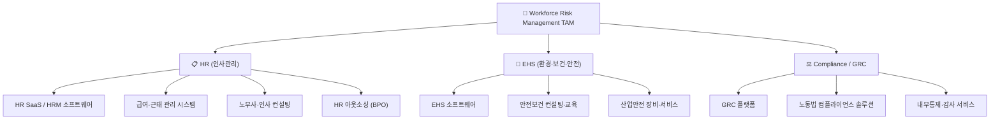
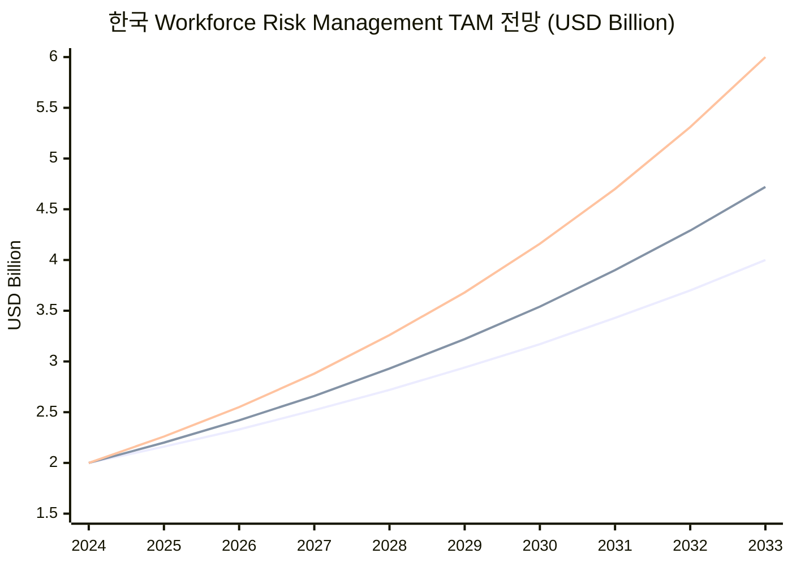
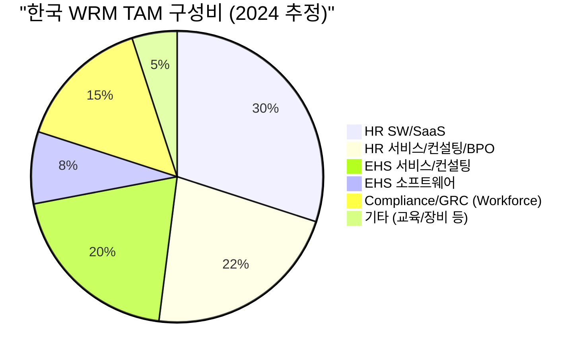

# 한국 Workforce Risk Management 시장 TAM 분석

> **분석 기준일**: 2026년 4월 | **분석 범위**: HR + EHS + Compliance, 전체 기업 규모, 전체 솔루션 유형(SW·서비스·컨설팅)

---

## 1. Executive Summary

| 구분 | 2024년 추정 (USD) | 2024년 추정 (KRW, 1USD=1,350원) |
|---|---|---|
| **Workforce Risk Management TAM (합산)** | **약 $2.45B ~ $2.85B** | **약 3.3조 ~ 3.8조 원** |

> [!IMPORTANT]
> "Workforce Risk Management"는 단일 시장 리포트가 존재하지 않는 **복합 시장(Composite Market)**입니다.
> 아래에서는 3개 핵심 세그먼트(HR·EHS·Compliance/GRC)를 Bottom-up으로 합산하고, 관련 시장 데이터로 크로스체크합니다.

---

## 2. 시장 정의 및 범위

Workforce Risk Management = **근로자(Workforce)와 관련된 모든 리스크를 관리하는 제품·서비스·컨설팅 시장**

### 포함 범위
- ✅ 소프트웨어 (SaaS, On-premise)
- ✅ 전문 서비스 (컨설팅, 교육, 기술지도)
- ✅ 아웃소싱 서비스 (급여, 인사, 안전관리 위탁)
- ✅ 전체 기업 규모 (대기업 ~ 소기업, 5인 이상)
- ✅ 전체 산업 (제조, 건설, 물류, 서비스 등)

---

## 3. 세그먼트별 시장 규모 (2024년 기준)

### 3.1 HR 세그먼트

| 하위 시장 | 2024년 규모 (USD) | 출처 | CAGR |
|---|---|---|---|
| HR Technology (HR SaaS/SW) | $686M | IMARC Group | 7.55% (→2033) |
| HRM 시장 (넓은 범위) | $713M | Grand View Research | 16.3% (→2030) |
| 노무사·인사 컨설팅 서비스 | $200~300M (추정) | 복합 추정 | — |
| HR BPO (인사 아웃소싱) | $300~400M (추정) | BPO 시장 비중 기반 | — |

> [!NOTE]
> **HR 세그먼트 합산: 약 $1.0B ~ $1.2B (약 1.35조~1.62조 원)**
> - SW/SaaS만으로도 $686~713M 수준
> - 노무사(약 2.6만명 활동), HR 컨설팅, BPO 서비스 포함 시 $1B 이상
> - 한국 BPO 전체 시장($5.69B) 중 HR 관련 비중 약 5~7%로 추정

---

### 3.2 EHS 세그먼트

| 하위 시장 | 2024년 규모 (USD) | 출처 | CAGR |
|---|---|---|---|
| EHS 전체 (SW + 서비스) | $762M | Grand View Research | 7~9.1% (→2035) |
| └ EHS 소프트웨어 | $150~200M (추정) | FMI, 서비스 vs SW 비중 기반 | 9~12% |
| └ 안전보건 서비스·컨설팅 | $400~500M (추정) | 서비스 최대 세그먼트 | 7~8% |
| └ 산업안전 장비·솔루션 | $100~150M (추정) | 장비 관련 세그먼트 | 6~7% |

> [!NOTE]
> **EHS 세그먼트 합산: 약 $762M (약 1.03조 원)**
> - 2024년 1월 중대재해처벌법 5인 이상 사업장 확대 적용이 핵심 성장 동인
> - 서비스(컨설팅/교육/기술지도)가 최대 비중, SW가 가장 빠른 성장

---

### 3.3 Compliance / GRC 세그먼트

| 하위 시장 | 2024년 규모 (USD) | 출처 | CAGR |
|---|---|---|---|
| 리스크 관리 시장 | $256M | IMARC Group | 13.04% (→2033) |
| 엔터프라이즈 GRC 시장 | $1,217M (2025) | Grand View Research | — |
| └ Workforce 관련 GRC 비중 | $300~500M (추정) | 전체 GRC의 25~40% | — |

> [!WARNING]
> GRC 시장은 사이버 보안, 재무 리스크 등을 포함한 광범위한 시장입니다.
> Workforce(인력) 관련 Compliance만 추출하면 전체 GRC의 약 25~40%로 추정합니다.

> [!NOTE]
> **Compliance/GRC 세그먼트 (Workforce 관련): 약 $300~500M (약 4,050억~6,750억 원)**

---

## 4. TAM 합산 (Bottom-Up)

| 세그먼트 | 2024 Low (USD) | 2024 High (USD) |
|---|---|---|
| HR (SW + 서비스 + 컨설팅 + BPO) | $1,000M | $1,200M |
| EHS (SW + 서비스 + 장비) | $762M | $850M |
| Compliance/GRC (Workforce 관련) | $300M | $500M |
| **중복 보정 (-10~15%)** | -$206M | -$383M |
| **= Workforce Risk Management TAM** | **~$1,856M** | **~$2,167M** |

> [!IMPORTANT]
> ### 보수적 추정: **약 $1.9B ~ $2.2B (약 2.5조 ~ 3.0조 원)**
> ### 적극적 추정 (중복 보정 최소화): **약 $2.5B ~ $2.9B (약 3.3조 ~ 3.8조 원)**
>
> 중복 보정은 HR SaaS에 내장된 간이 Compliance 기능, EHS 서비스에 포함된 법률 자문 등 세그먼트 간 겹치는 부분을 감안한 것입니다.

---

## 5. 성장 전망 (2030년 / 2033년)

| 시나리오 | 2030년 전망 (USD) | 2033년 전망 (USD) |
|---|---|---|
| 보수적 (CAGR 8%) | ~$2.9B | ~$3.7B |
| 기본 (CAGR 10%) | ~$3.4B | ~$4.5B |
| 적극적 (CAGR 13%) | ~$4.0B | ~$5.7B |

---

## 6. Top-Down 크로스체크

TAM 추정의 합리성을 검증하기 위해, 독립적인 Top-Down 관점에서도 확인합니다.

### 방법 1: 기업 수 × 평균 지출

| 항목 | 수치 |
|---|---|
| 한국 전체 사업체 수 (5인 이상) | 약 400,000~450,000개 |
| 평균 Workforce Risk Management 지출 | 연 $4,000~6,000/사업체 |
| **추정 TAM** | **$1.6B ~ $2.7B** |

→ Bottom-up 추정 범위($1.9B~$2.9B)와 대체로 일치

### 방법 2: GDP 대비 비율

| 항목 | 수치 |
|---|---|
| 한국 GDP (2024) | 약 $1.7 Trillion |
| 글로벌 WRM/GDP 비율 | 약 0.10~0.15% |
| **추정 TAM** | **$1.7B ~ $2.6B** |

→ Bottom-up 추정 범위와 대체로 일치

---

## 7. 핵심 성장 동인

| 동인 | 영향 | 정도 |
|---|---|---|
| **중대재해처벌법 확대** (5인 이상 전면 적용) | 안전관리 체계 의무화 → EHS 수요 급증 | 🔴 매우 높음 |
| **ESG 공시 의무화** (2028년 예정) | 비재무 리스크 관리 체계 필수 | 🔴 매우 높음 |
| **주 52시간 근로제 강화** | HR 컴플라이언스 자동화 수요 | 🟠 높음 |
| **AI/디지털 전환** | 예측형 리스크 관리, 자동화 | 🟠 높음 |
| **노동 시장 유연화** | 플랫폼/비정규 근로자 관리 복잡화 | 🟡 중간 |

---

## 8. 시장 구조 요약

---

## 9. 출처 및 참고자료

| 출처 | 시장 | 데이터 |
|---|---|---|
| IMARC Group | 한국 HR Tech | $686M (2024), CAGR 7.55% |
| Grand View Research | 한국 HRM | $713M (2024), CAGR 16.3% |
| Grand View Research | 한국 EHS | $762M (2024), CAGR 7~9.1% |
| IMARC Group | 한국 리스크 관리 | $256M (2024), CAGR 13.04% |
| Grand View Research | 한국 엔터프라이즈 GRC | $1,217M (2025) |
| Future Market Insights | 한국 EHS | CAGR 9.1% (→2035) |
| 한국경제 | 노무사 시장 | 시험 응시자 1.3만명+, 시장 확대 |
| 안전보건공단 | 중대재해처벌법 | 2024.1.27 5인 이상 확대 |

---

> [!TIP]
> ### 귀사 사업(HR+EHS 통합 SaaS) 관점에서의 시사점
> - **TAM ~3조 원**은 스타트업이 진입하기에 충분히 큰 시장
> - HR+EHS **통합** 영역은 현재 시장 공백(White Space)으로, 기존 플레이어들이 분절적으로만 커버
> - 중대재해처벌법 5인 이상 확대 → **중속기업 대상 경량 EHS SaaS**의 즉각적 수요 창출
> - SAM(Serviceable Available Market)으로 좁히면 중소·중견기업(20~200인) 제조·건설·물류 = 약 **3,000억~5,000억 원** 추정
